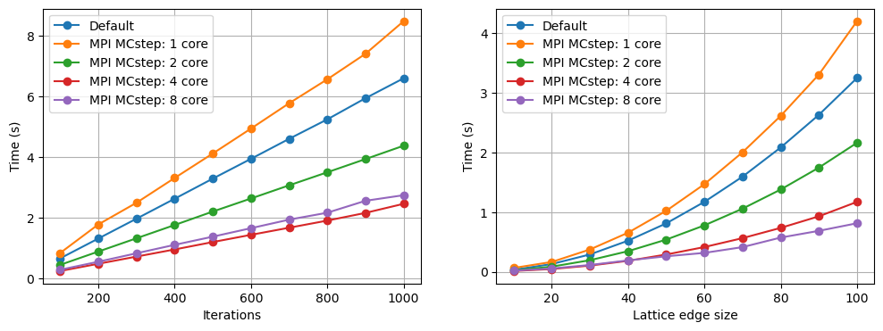

# SCIFM0004 Programming Project 1
Sebastian Parkin 

## **Optimisation with MPI**  

### **Method**

To parallelise this program with MPI, a nmax<sup>2</sup> x 2 sized array was created, which contains the index for every position in the lattice. This array is then split using ```np.array_split()``` and scattered to each core using ```comm.scatter()```. This creates a set of local indexes that each core will use, which are sent to each function, like ```get_order()``` and ```all_energy()```. Each core will then work on a section of the lattice simultaneously, speeding up the program. At the end of the program, the result is reduced using ```comm.reduce()```, which adds up the result from every core.

However, when multithreading ```MC_step()```, the random selection of each point in the lattice had to be removed. This was so that the modified lattice could be combined afterwards. However, a small amount of information is lost with this method, due to the ```one_energy()``` function using adjacent cells in its calculation. For this reason, a seperate file with parallelisation of ```MC_step()``` was created. To parallelise ```MC_step()```, the same indexing array was used as for the other functions. Since the lattice is changed in this function, the lattice had to be split, gathered using ```comm.gather()```, concatenated, and then broadcasted to each core with ```comm.bcast()``` at the end of each iteration.

### **Ease of coding and maintenance, flexibility of approach**

Mpi4py is relatively easy to implement once you understand how it works. It is easily maintained, as once the variable is split between cores, in this instance the lattice index array, any new functions can use this array, and the work will already be split for each core. It also allows for control over which specific parts of the code are parallelised, making it highly flexible.

## **Optimisation with Cython**

### **Method**

For the greatest speedups, as much of the program as possible has to be taken out of the Python Global-Interpreter-Lock (GIL), which locks the program to one thread. The program should also contain few Python elements, as these are slow. First, variable assignment was handled with ```cdef``` and its variable type. With numpy arrays, ```cdef double[:,:]``` was used as a 'view' into that array. Then, numpy functions like ```np.cos()``` and ```np.sin()``` were replaced with their cmath counterparts. For easier bug-fixing, individual functions were copied into a different files and tested.

```one_energy()```, ```all_energy()``` and ```get_order()``` were simple to take out of the GIL. In ```MC_Step()```, instead of calculating a random number on each iteration, a random number array the same size as the lattice was used, allowing the loop to be taken out of the GIL. By replacing ```range()``` with ```prange(num_threads = {core number})``` on the for loops the code was able to be parallelised.

Mpi4py was used with Cython to have more control over the parallelisation. The same method as before was used, by splitting the lattice indexes and sending them to each core. The variables are reduced at the end of the program, except for the lattice which has to be split, gathered and broadcast at the end of each iteration.

### **Ease of implementation and flexibility**

Cython was the most difficult speedup to implement. This is due to the assigning of every variable to a cython variable, and changing python functions to C++ functions. The necessity of a setup and run script made it harder to test and bug fix. You can change which loops are parallelised using ```prange()```, making it somewhat flexible.

Using MPI with Cython was also difficult, as the MPI functions cannot be used without the GIL. ```comm.reduce()``` and ```comm.gather()``` assign NoneType variables to every other core but rank 0, making them incompatible with Cython variables. However, MPI allows for more control over parallelisation, which can result in a speedup.

## **Optimisation with Numpy Vectorisation**

### **Method**

To speed up this program with NumPy, loops should be replaced with NumPy array broadcasting. This is not possible for the first loop, as that needs to be iterative. With ```one_energy()```, replacing the four calculations with a numpy array was slower, so the original code was kept. In ```all_energy()``` and ```get_order()```, the nmax loops were replaced by using ```[:]``` array indexing, which will perform the calculation for every value in a dimension of the array, and by using ```np.sum()``` to add up the total.

```MC_step()``` was the most difficult to implement, as the angles in the lattice cannot be changed all at once, which would happen using ```[:]``` array indexing. This is because the energy of each position in the lattice is dependent on the positions adjacent to it. To counter this, a checkerboard system was used, so on each iteration no adjacent positions are ever changed, which required a loop of length two.

### **Ease of implementation and flexibility**

NumPy was not too difficult to implement, as I already knew how to use NumPy vectorisation. The ```MC_step()``` vectorisation proved to be a difficult task however, as it indexing an array more than once and trying to change values does not work. This was a problem when certain angles need to revert back to normal upon certain conditions. To circumvent this I used multiple ```np.where()``` in a row to get the specific indexes of the original lattice, even after multiple index selections were performed. There is no option for parallelisation with NumPy, making it ineffective for speedups with supercomputers that have large numbers of cores compared to multithreaded programs.

## **Optimisation with Numba**

To speed up programs with Numba, you just need to put ```@numba.jit()``` before each function that contains loops. This does not work with certain NumPy functions, so certain loops had to be taken out of their parent function and put into a new function. Putting ```nopython = True``` inside the brackets results in a larger speedup.
Parallelising using ```numba.prange()``` was attempted but slowed the program down massively. The program was instead parallelised with mpi4py with the same method as before.

### **Ease of implementation and flexibility**

This was the easiest to implement, as it only required a few lines of code and to move some functions around. ```numba.prange()``` resulted in the program being far slower, even slower than default. Without parallelisation working, it has the same problem as NumPy where it is ineffective on multi-cored supercomputers compared to multithreaded programs. Mpi4py with Numba can be used to solve this issue

## **Speedup Comparisons**



**Figure 1:** MPI MCstep and default speeds. When iterations are changed, lattice size is 20 x 20, and when lattice size is changed, iteration count is 20. 1 core MPI is slower than normal for both iteration count and lattice size, which is due to the extra processes needed for MPI, and with no parallelisation. 4 cores is the fastest with iteration count, which is likely due to there being 4 performance cores and 4 efficiency cores in my machine, so switching to 8 cores does not result in a speedup. For lattice size there is a speedup at 8 cores however, which is likely because the lattice is the array that is parallelised, so a greater core count has a greater effect on this speedup, even while using efficiency cores. The iterations chart follows a linear path, and the size chart an x^2 line, which makes sense.


**Figure 2:** NumPy, Numba and Cython speeds. When iterations are changed, the lattice is 50 x 50, and when lattice size is changed, the iterations are 200. Numba is faster than NumPy, with Cython being faster than both of them.


**Figure 3:** Cython and Cython with MPI speeds, at 1, 2, 4 and 8 cores. When iterations are changed, the lattice is 50 x 50, and when lattice size is changed, the iterations are 200. 4 core Cython with MPI is the quickest, followed by 2 core Cython with MPI, followed by 4 core Cython without MPI. 4 core Cython MPI may be quicker than 4 core Cython because there is more control over parallelisation with MPI. 8 core Cython MPI is the slowest when iterations are changed, but with lattice size it has a smaller gradient than the others. With larger lattice sizes, it could be faster.


**Figure 4:** Cython MPI speeds with up to 500 x 500 lattice sizes. 8 core Cython MPI has similar speeds to 2 core Cython MPI and 4 core is still the fastest.


**Figure 5:** Numba with and without MPI. When iterations were changed, the lattice was 50 x 50, and when lattice size was changed, the iterations were 200. Only Numba MPI with 4 cores was faster than the original Numba code, which must be due to the mpi4py processes which slow the program down.

<div>
<table border="1" class="dataframe">
  <thead>
    <tr style="text-align: right;">
      <th></th>
      <th>Time (s)</th>
      <th>Speedup multiplier</th>
    </tr>
  </thead>
  <tbody>
    <tr>
      <th>Cython</th>
      <td>0.0949</td>
      <td>85.60</td>
    </tr>
    <tr>
      <th>Cython MPI</th>
      <td>0.0413</td>
      <td>196.87</td>
    </tr>
    <tr>
      <th>Default</th>
      <td>8.1270</td>
      <td>1.00</td>
    </tr>
    <tr>
      <th>MPI</th>
      <td>6.1571</td>
      <td>1.32</td>
    </tr>
    <tr>
      <th>MPI MC step</th>
      <td>2.8170</td>
      <td>2.88</td>
    </tr>
    <tr>
      <th>NumPy</th>
      <td>0.2346</td>
      <td>34.64</td>
    </tr>
    <tr>
      <th>Numba</th>
      <td>0.1787</td>
      <td>45.48</td>
    </tr>
    <tr>
      <th>Numba MPI</th>
      <td>0.1545</td>
      <td>52.61</td>
    </tr>
  </tbody>
</table>
</div>

**Table 1:** The time taken for each program with 200 steps and 50 x 50 lattice size. For multithreaded programs 4 cores were used. 3 timings were performed and the average found. The default time was divided by each time to get the speedup multiplier.


**Figure 5:** The relative speedup plotted onto a bar chart.

## **Conclusion**

Cython with MPI gives by far the largest speedup, ~200 times quicker than the original code, but is the hardest to implement. The best optimisation for speedup whilst being easy to implement is Numba, which resulted in a speedup of ~45 times quicker than the original code, but is not parallel so may not work with supercomputers with a large number of cores.

Overall, Cython with MPI is the best option if an iterative program is needed to run as fast as possible on multiple cores. This is due to it being compiled with C, making it very fast, and because of the flexiblity with MPI parallelisation.


## Instructions on running the programs:
* Each program is inside its respective folder (LL_mpi, LL_numpy etc)
* To run the python 

## Github link:

