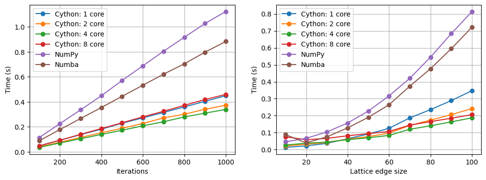

# Report Draft 1

**How to multithread this program?**  

The program has to run iteratively for the crystals to reorganise, so multithreading across the main iteration wont work. Instead it should be multithreaded across the lattice loops.  

**Optimisation with MPI**  

**Method**

Mpi4py required many tests to figure out how to implement it within the LL code. This was to find out how the work would be best split between each core. When mpiexec is used in the command line to run a program, the same program is run on those 4 cores, so you have 4 identical instances of the program running. You then use the mpi commands, like scatter, gather, reduce etc to communicate between the cores. However, having the same program run on each core does not reduce the amount of time the program takes. So you need to split the work up between each core.  

I did this by creating a list of every index in the nmax x nmax lattice. This becomes an array that has nmax x nmax rows and 2 columns. This array is then split using ```np.array_split()``` and scattered to each core using ```comm.scatter()```. This creates a set of local indexes that each core will use, which are sent to each function, like ```get_order()``` and ```all_energy()```. Each core will then work on a section of the lattice simultaneously, speeding up the program. The result is then be reduced using ```comm.reduce()```, to add up the result from every core.

However, when multithreading ```MC_step()```, the random selection of each point in the lattice had to be removed. This was so that the modified lattice could be combined afterwards. However, a small amount of information is lost with this method. In the ```one_energy()``` function, the energy is calculated using all the adjacent points in the lattice. When this is parallelised, the section worked on by one core cannot observe the changes that the other core has made, until the end of the iteration where it is combined. This means that the edge points of each section change their angle dependent on some cells that may have changed already in the other core. For this reason, I created a seperate file with parallelisation of ```MC_step()```.

To parallelise ```MC_step()```, the same indexing array was used as for the other functions. However, since the lattice is changed in this function, the lattice had to be split, gathered using ```comm.gather()```, concatenated, and then broadcasted to each core using ```comm.bcast()``` at the end of each iteration.

Too much waffle here, cut down.

**Ease of coding and maintenance, flexibility of approach**

mpi4py is relatively easy to implement once you understand how it works. It is easily maintained, as once the variable is split between cores, in this instance the lattice index array, any new functions can use this array and the work will already be split for each core. It also allows for control over which specific parts of the code are parallelised, making it highly flexible.

**Speedup compared to default**

This resulted in a small speedup compared to the original python code. The original code, with 50 size and 50 steps, took ~1.9s. The parallelised code without ```MC_step()``` parallelised took ~1.5s, and the code with ```MC_step()``` parallelised took ~0.7s, each with 4 cores


Here time is plotted against iteration count and edge size of the lattice for MPI with MC_step and default. When iterations are changed, lattice size is 20 x 20, and when lattice size is changed, iteration count is 20. 1 core MPI is slower than normal for both iteration count and lattice size, which is due to the extra processes needed for MPI, but with no parallelisation. 4 cores is the fastest with iteration count, which is likely due to there being 4 performance cores and 4 efficiency cores in my machine, so switching to 8 cores does not result in a speedup. For lattice size there is a speedup at 8 cores however, which is likely because the lattice is the array that is parallelised, so a greater core count has a greater effect on this speedup, even while using efficiency cores. The iterations chart follows a linear path, and the size chart an x^2 line, which makes sense.

**Optimisation with Cython**

**Method**

In order to get the best Cython optimisation, you need to exit the GIL (explain here). However, the code will not work if any python elements are inside the nogil marked code. To figure out how each function could be made compatible with nogil, I copied each function into a seperate file, used ```cdef``` to define each variable and compiled and ran the code to check it worked.

The main issue I found with this method was functions like ```cos```, ```sin``` and ```pow``` using the python library when I wanted to use ```libc.math``` library. To fix this I had to import it under a different name, and this fixed the problem.

All numpy functions had to be outside the loops i was trying to nogil, so in MC step the uniform random checker had to be changed to an nmax * nmax array outside of the loop. The entirety of one_energy and all_energy function was run without gil.

By using ```prange``` I was able to parallelise the code.

mpi4py was used with Cython to have more control over the parallelisation. The same method as before was used, by splitting the lattice indexes and sending them to each core. The variables are reduced at the end of the program, except for the lattice which has to be split, gathered and broadcast at the end of each iteration.

**Ease of implementation and flexibility**

Cython was the most difficult speedup to implement. This is due to the assigning of every variable to a cython variable, and changing python functions to C++ functions. The necessity of a setup and run script made it harder to test and bug fix. You can change which loops are parallelised using prange, making it somewhat flexible.

Using MPI with Cython was also difficult, as the MPI functions cannot be used without the GIL. comm.reduce() and comm.gather() assign NoneType variables to every other core but rank 0, making them incompatible with Cython variables. However, MPI allows for more control over parallelisation, which can result in a speedup.

**Speedup**

Cython resulted in a very large speedup compared to default, >100 times quicker with lattice size 50 and 50 iterations, and faster than that with MPI also.


Here you can see the speed of each Cython with and without MPI compared against one another, at 1, 2, 4 and 8 cores. When iterations are changed, the lattice is 50 x 50, and when lattice size is changed, the iterations are 200. 4 core Cython with MPI is the quickest, followed by 2 core Cython with MPI, followed by 4 core Cython without MPI. 4 cores MPI could be the fastest because my computer has 4 performance cores, so 8 cores is actually slower, and because there is more control over MPI parallelisation rather than Cython parallisation.

**Optimisation with Numpy Vectorisation**

**Method**

To speed up this program with NumPy, loops should be replaced with NumPy array broadcasting. This is not possible for the first loop, as that needs to be iterative. With ```one_energy()```, replacing the four calculations with a numpy array was slower, so the original code was kept. In ```all_energy()``` and ```get_order()```, the nmax loops were replaced by using ```:``` array indexing, which will perform the calculation for every value in a dimension of the array, and by using ```np.sum()``` to add up the total.

MC_step was the most difficult to implement, as the angles in the lattice cannot be changed all at once. This is because the energy of each position in the lattice is dependent on the positions adjacent to it. To counter this, a checkerboard system was used, so on each iteration no adjacent positions are ever changed. This required a a loop of range(2).

**Ease of implementation and flexibility**

NumPy was not too difficult to implement, as I already knew how to use NumPy vectorisation. The MC_step vectorisation proved to be a difficult task however, as it indexing an array more than once and trying to change values does not work. To circumvent this I used multiple ```np.where()``` in a row to get the specific indexes of the original lattice after multiple changes had been made to it.

**Speedup compared to default**

Finish later

**Optimisation with Numba**

To speed up programs with Numba,you just need to put ```@numba.jit()``` before each function that contains loops. This does not work with certain NumPy functions, so certain loops had to be taken out of their parent function and put into a new function. Putting ```nopython = True``` inside brackets meant that the function could be taken out of the GIL, resulting in more of a speedup.
Parallelising using ```numba.prange()``` was attempted but was unsuccessful.

**Ease of implementation and flexibility**

This was the easiest to implement, as it only required a few lines of code and moving some functions around.

**Speedup**



NumPy, Numba and Cython speeds. When iterations are changed, the lattice is 50 x 50, and when lattice size is changed, the iterations are 200. Numba is faster than NumPy, with Cython being faster than both of them.

**Speedup Comparisons**

<div>
<style scoped>
    .dataframe tbody tr th:only-of-type {
        vertical-align: middle;
    }

    .dataframe tbody tr th {
        vertical-align: top;
    }

    .dataframe thead th {
        text-align: right;
    }
</style>
<table border="1" class="dataframe">
  <thead>
    <tr style="text-align: right;">
      <th></th>
      <th>Time (s)</th>
      <th>Speedup multiplier</th>
    </tr>
  </thead>
  <tbody>
    <tr>
      <th>Cython</th>
      <td>0.095</td>
      <td>85.60</td>
    </tr>
    <tr>
      <th>Cython MPI</th>
      <td>0.041</td>
      <td>196.87</td>
    </tr>
    <tr>
      <th>Default</th>
      <td>8.127</td>
      <td>1.00</td>
    </tr>
    <tr>
      <th>MPI</th>
      <td>6.157</td>
      <td>1.32</td>
    </tr>
    <tr>
      <th>MPI MC step</th>
      <td>2.817</td>
      <td>2.88</td>
    </tr>
    <tr>
      <th>NumPy</th>
      <td>0.235</td>
      <td>34.64</td>
    </tr>
    <tr>
      <th>Numba</th>
      <td>0.179</td>
      <td>45.48</td>
    </tr>
  </tbody>
</table>
</div>


These times were calculated with an iteration count of 200 and a lattice size of 50. For multithreaded programs 4 cores were used. 3 timings were performed and the average found. The default time was divided by each time to get the speedup multiplier.

**Conclusion**

Cython with MPI gives by far the largest speedup, ~200 times quicker than the original code, but is the hardest to implement. The best optimisation for speedup whilst being easy to implement is Numba, which resulted in a speedup of ~45 times quicker than the original code.
